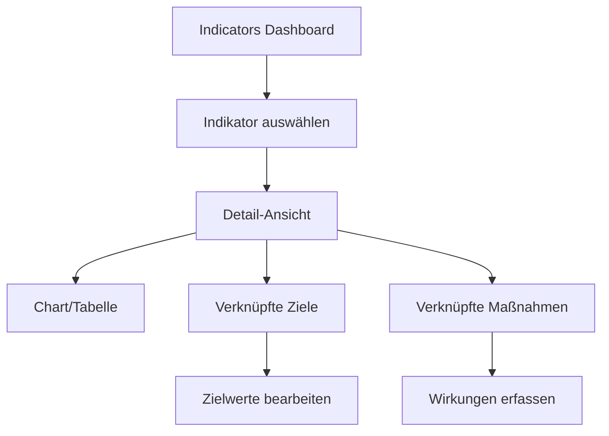

# Indikatoren-Funktionalität Analyse

**Erstellt:** 2025-08-13  
**Kontext:** Plattform-Audit zur Funktionsweise der Indikatoren  
**Basis:** Codebase-Analyse und Meeting-Notizen

## 🎯 Überblick

Indikatoren bilden ein zentrales Element der knot-dots Plattform zur Messung und Steuerung von Nachhaltigkeitsmaßnahmen. Sie verknüpfen Ist-Daten mit Zielvorgaben und ermöglichen die Bewertung von Maßnahmenwirkungen.

### Kernfunktionen
- **Kennzahlen-Management**: Verwaltung von KPIs mit Basisdaten und Zielwerten
- **Wirkungsmessung**: Verknüpfung von Maßnahmen mit messbaren Ergebnissen  
- **Zielverfolgung**: Monitoring von gewünschter Entwicklung vs. Ist-Stand
- **Visualisierung**: Charts und Tabellen für Datenanalyse

## 🏗️ Datenmodell & Architektur

### Container-basierte Struktur
```typescript
// Indikator als Container-Typ
const indicatorPayload = basePayload.extend({
  historicalValues: z.array(z.tuple([z.number().int().positive(), z.number()])).default([]),
  indicatorCategory: z.array(indicatorCategories).default([]),
  indicatorType: z.array(indicatorTypes).default([]),
  measureType: z.array(measureTypes).default([]),
  quantity: z.string(),
  type: z.literal(payloadTypes.enum.indicator),
  unit: z.string()
});
```

### Indikator-Eigenschaften
**Basisdaten:**
- `title`: Bezeichnung des Indikators
- `description`: Detaillierte Beschreibung
- `quantity`: Art der Messung (CO2, Energie, etc.)
- `unit`: Maßeinheit (kg, kWh, %, etc.)

**Kategorisierung:**
- `indicatorType`: Impact, Key, Performance
- `indicatorCategory`: KPI, MPSC, SDG, Custom
- `measureType`: Technische Klassifikation
- `topic`: Themenfelder (Mobilität, Energie, etc.)
- `category`: SDG-Zuordnung

**Zeitreihendaten:**
- `historicalValues`: Array von [Jahr, Wert]-Tupeln für Ist-Daten

### Beziehungsmodell
```typescript
// Zentrale Relationen für Indikatoren
predicates = [
  'is-measured-by',      // Ziel → Indikator
  'is-objective-for',    // Zielwert → Indikator  
  'contributes-to',      // Maßnahme → Indikator
]
```

## 🎛️ Benutzeroberfläche & Komponenten

### Haupt-Komponenten

#### 1. EditableIndicatorDetailView
- **Zweck**: Vollständige Indikator-Ansicht mit Bearbeitung
- **Features**: 
  - Tab-Navigation (Alle, Ziele, Maßnahmen)
  - Umschaltung Chart/Tabelle
  - Verknüpfte Container anzeigen
  - Historische Werte bearbeiten

#### 2. IndicatorChart 
- **Zweck**: Visualisierung von Zeitreihen und Prognosen
- **Features**:
  - Observable Plot-basierte Charts
  - Trend-Linie aus historischen Daten
  - Zielwerte als separate Linie
  - Maßnahmenwirkungen als gestapelte Bereiche
  - Status-basierte Farbcodierung

#### 3. IndicatorProperties
- **Zweck**: Metadaten-Verwaltung
- **Features**:
  - Indikator-Typ, Einheit, Kategorie
  - SDG- und Themen-Zuordnung
  - Sichtbarkeit und Berechtigungen
  - Organisationseinheit-Zuordnung

#### 4. IndicatorsOverlay
- **Zweck**: Übersichts-Dashboard aller Indikatoren
- **Features**:
  - Facettierte Suche und Filter
  - Kategorisierung nach Typ/Thema
  - Kachel-Ansicht der Indikatoren

### Navigation & Workflow


## 🔗 Verknüpfungslogik

### Indikator ↔ Ziele
**Relation**: `is-measured-by`
```typescript
// Ziel wird durch Indikator gemessen
{
  subject: zielGuid,
  predicate: 'is-measured-by', 
  object: indikatorGuid
}
```

**Zielwerte (Objectives)**:
- Separate Container vom Typ `objective`
- `wantedValues`: Array von [Jahr, Zielwert]-Tupeln
- Relation `is-objective-for` zum Indikator

### Indikator ↔ Maßnahmen  
**Relation**: `contributes-to`
```typescript
// Maßnahme trägt zu Indikator bei
{
  subject: maßnahmeGuid,
  predicate: 'contributes-to',
  object: indikatorGuid  
}
```

**Wirkungen (Effects)**:
- Container vom Typ `effect` 
- `achievedValues`: Erreichte Werte
- `plannedValues`: Geplante Wirkung
- Hierarchisch unter Maßnahmen (`is-part-of-measure`)

## 📊 Berechnungslogik

### Chart-Darstellung
1. **Basis-Trend**: Historische Werte als Linie
2. **Zielwerte**: Separate Linie für gewünschte Entwicklung
3. **Maßnahmenwirkungen**: 
   - Gestapelte Bereiche nach Status
   - Grün: Umgesetzte Wirkung (`status.done`)
   - Orange: In Umsetzung (`status.in_implementation`)
   - Rot: Geplant (`status.idea`)

### Aggregations-Regeln
```typescript
// Zielwerte summieren sich
objectives = findLeafObjectives(relatedContainers)
  .flatMap(({payload}) => payload.wantedValues)
  .reduce((acc, [year, value]) => {
    // Summierung bei gleichem Jahr
    return groupIndex > -1 
      ? [...acc.slice(0, groupIndex), [year, value + acc[groupIndex][1]], ...acc.slice(groupIndex + 1)]
      : [...acc, [year, value]];
  }, []);
```

## 🚧 Identifizierte UX-Probleme

### Aus Meeting-Analyse

#### 1. Navigations-Komplexität
- **Problem**: "Navigation zu Indikatoren noch zu verschachtelt"
- **Auswirkung**: Kontext geht verloren bei Ziel-Indikator-Verknüpfung
- **Workflow**: Zu viele Schritte für einfache Aufgaben

#### 2. Bearbeitungsbeschränkungen
- **Problem**: "Benutzer können nur Basisdaten aktualisieren"
- **Einschränkung**: Keine direkte Bearbeitung von Zielwerten in Zielen
- **Workaround**: Umweg über Programme erforderlich

#### 3. Filter-Probleme
- **Problem**: "Filtereinstellungen zu dumm" bei "gewünschte Entwicklung"
- **Auswirkung**: Nicht hilfreiche Vorauswahl
- **Bedarf**: Intelligentere Kontext-Filter

#### 4. Zielwert-Berechnungen
- **Problem**: "Immer Differenz zum aktuellen Prognose angeben"
- **Erwünscht**: Absolute Zielwerte direkt eingeben
- **Herausforderung**: Wissenschaftlich korrekte Berechnungsmodelle

#### 5. Katalog-Usability  
- **Problem**: "Suche nicht sinnvoll" im Indikator-Katalog
- **Grund**: Nutzer kennen meist schon benötigte Indikatoren
- **Verbesserung**: Überschriften und "Neue oben" Sortierung

## 🎯 Nutzungsszenarien

### 1. Indikator erstellen (Setzkasten-Modus)
```typescript
// Workflow für neue Indikatoren
1. Indikator anlegen (Typ, Einheit, Kategorien)
2. Basisdaten eintragen (historicalValues)
3. Zielwerte definieren (Objective erstellen)
4. Mit Strategie verknüpfen (is-measured-by)
```

### 2. Wirkungserfassung
```typescript
// Maßnahmen-Wirkung dokumentieren
1. Effect-Container erstellen
2. Geplante/Erreichte Werte eintragen
3. Mit Maßnahme verknüpfen (is-part-of-measure)
4. Mit Indikator verknüpfen (contributes-to)
```

### 3. Monitoring & Controlling
```typescript
// Regelmäßige Bewertung
1. Ist-Daten aktualisieren (historicalValues)
2. Zielabweichung analysieren (Chart)
3. Maßnahmen-Performance bewerten
4. Steuerungsmaßnahmen ableiten
```

## 🔧 Technische Implementation

### Datenbank-Struktur
```sql
-- Indikator-spezifische Abfragen
SELECT DISTINCT(c.*)
FROM container c
JOIN container_relation cr ON c.guid = cr.object
  AND cr.predicate IN ('is-measured-by', 'is-objective-for')
  AND cr.valid_currently
  AND NOT cr.deleted
```

### State Management
```typescript
// Svelte Stores für Indikator-Daten
let historicalValuesByYear = $derived(new Map(container.payload.historicalValues));
let objectives = $derived.by(() => {
  return findLeafObjectives(relatedContainers.filter(isObjectiveContainer))
    .flatMap(({payload}) => payload.wantedValues)
    // Aggregationslogik
});
```

## 🎨 Design-Patterns

### Editable Components
- Konsistente `editable`-Props für Bearbeitungsmodus
- Ability-basierte Berechtigungsprüfung
- Bindable Props für Zwei-Wege-Datenbindung

### Chart-Visualisierung
- Observable Plot für moderne Datenvisualisierung
- Reaktive Berechnungen mit Svelte 5 `$derived`
- Status-basierte Farbkodierung für Übersichtlichkeit

### Container-Relations
- Typisierte Prädikat-Konstanten
- Hierarchische Traversierung (Ancestors/Descendants)
- Position-basierte Sortierung

## 📋 Verbesserungspotentiale

### Kurzfristig
1. **Direkte Zielwert-Bearbeitung** in Indikator-Ansicht
2. **Intelligente Filter** bei Ziel-Indikator-Verknüpfung  
3. **Kontextuelle Navigation** ohne Seitenwechsel
4. **Absolute Zielwerte** statt nur Differenzen

### Mittelfristig  
1. **Indikator-Templates** für häufige Kennzahlen
2. **Batch-Import** für historische Daten
3. **Automatisierte Berechnungen** für komplexe Indikatoren
4. **Dashboard-Widgets** für Executive Summary

### Langfristig
1. **KI-gestützte Prognosen** basierend auf Trends
2. **Cross-Indikator-Analysen** für Wirkungsketten
3. **Real-time Datenquellen** für Live-Updates
4. **Benchmark-Vergleiche** mit anderen Organisationen

## 🔍 Code-Qualität & Architektur

### Stärken
- ✅ Typsichere Zod-Schemas für Datenvalidierung
- ✅ Modulare Komponentenarchitektur  
- ✅ Konsistente Container-Abstraktion
- ✅ Reaktive State-Management mit Svelte 5

### Verbesserungsbedarf
- ⚠️ Komplexe Aggregations-Logik in Components
- ⚠️ Fehlende Abstraktions-Layer für Berechnungen
- ⚠️ Tight Coupling zwischen Chart und Business-Logic
- ⚠️ Unvollständige Test-Abdeckung für Beziehungslogik

---

**Fazit:** Die Indikator-Funktionalität zeigt eine solide technische Architektur, hat aber UX-seitig Optimierungsbedarf bei Navigation und Workflow-Effizienz. Die Container-basierte Struktur bietet Flexibilität, erfordert aber bessere Abstraktionen für komplexe Berechnungen.